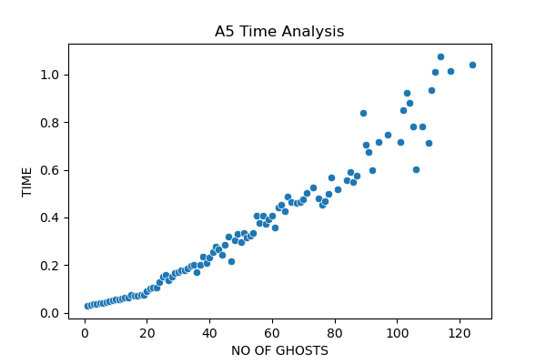

# Maze Game with Pygame


## Table of Contents

- [Introduction](#introduction)
- [Implementation](#implementation)
  - [The Environment](#the-environment)
  - [The Agent](#the-agent)
  - [The Problem: Ghosts](#the-problem-ghosts)
  - [The Strategies](#the-strategies)
- [Getting Started](#getting-started)
  - [Prerequisites](#prerequisites)
  - [Installation](#installation)
  - [Usage](#usage)
- [Analysis](#analysis)
- [License](#license)

## Introduction

Welcome to the 'Ghost in the Maze' project. This project serves a dual purpose:
1. To provide a hands-on experience in implementing and using search algorithms to solve complex problems, and,
2. to illustrate the distinction between planning and execution in uncertain environments.

This is achieved in an environment resembling a maze, with different agents designed to navigate through it, and collect data to analyze the agent's performance as it strives to reach its goal.

## Implementation

### The Environment

The environment consists of a maze-like square grid, with some cells open (unblocked) and others obstructed (blocked). The agent can move through unblocked cells but cannot traverse blocked ones. To create varied test environments, mazes are generated randomly, with a 51x51 grid.

The challenge lies in ensuring these mazes are navigable. DFS algorithm is used to verify the existence of paths from the upper left to the lower right corners before finalizing the randomly created maze as a valid environment.

### The Agent
The agent starts in the upper left corner and aims to reach the lower right corner. It can move in the cardinal directions (up, down, left, right) but only through unblocked squares. At any moment, the agent has complete knowledge of the entire maze, and hence can plan its path using it's strategy and updated maze information.

### The Problem: Ghosts
The maze is inhabited by multiple randomly spawned ghosts in the maze which can travel in cardinal directions and can tranverse through all the cells in the maze environment. The agent dies if a ghost encounters it. Ghosts move each time the agent does, which necessitates dynamic path planning by the agent to avoid collisions. Ghost picks any one of its adjacent cells, with probability of each cell of 25%. If the selected cell block is blocked, then there is a 50% probability that the agent will move towards it.

### The Strategies

Following Search Algorithms were primarily used for the simulations:

1. Depth First Search (DFS): 
    - To validate if there exists a path from the start cell (0, 0) cell to the goal cell (rightmost and bottommost cell) upon creation of the maze.
    - To check if each ghost spawned initially can be reached from the start node when the maze is created.
    - DFS will not give the shortest path, but is highly efficient in this case for its quicker execution as compared to other similar algorithms, and we only need to find if a path exists from start node to the goal node.
2. Breadth First Search (BFS):
    - To get the position of the nearest ghost for an Agent. The direction is then used to run away from the ghost.
    - BFS provides the shortest path in between two points. In this case, it is crucial to check the nearest ghost position, and hence BFS was selected as the most optimal algorithm for this task.
3. A* (A Star):
    - To determine 

Agent type and strategies implemented:

Agent # | Strategy Followed
 ------------ | ------------- 
1 | **Plan Once and Execute Blindly** : Possesses full knowledge of the blocked and unblocked cells in the maze and plans its entire path from source to destination at timestamp 0, completely disregarding the position of ghosts and their movements. This method results in a single, optimal plan executed without alterations and contigency plans in case ghost in encountered in between.
2 | **Plan at Every step** The Agent plans its path at the 0th timestamp and then continually evaluates the ghost's position at each timestamp. Thus the Agent adapts its course dynamically, ensuring it avoids encountering ghosts if the ghost appears in its path to the goal.
3 | **Forecasting on Agent 2’s knowledge** Relies on Agent 2's history data. When Agent 3 encounters a cell, it checks if Agent 2 has visited it before. If not, Agent 3 uses A* and mimics Agent 2's behavior. If the cell is unexplored, Agent 3 evaluates valid directions, selecting the one with maximum survivability. Explored cells prompt Agent 3 to mimic Agent 2 or stay put if no valid moves exist.
4 | **Plan only when needed** Equipped with a dynamic strategy that adapts to the presence of ghosts based on the parameters _visibility_ and _strike_. _Visibility parameter_ defines how far the ghost can see. Until the agent encounters a ghost within this visibility range, it remains steadfast on its current path, optimizing efficiency. _Strike parameter_ is set to 1 when a ghost enters the visibility range of the agent. This acts as an early warning, alerting Agent that a ghost is lurking nearby. If in the next turn too the ghost remains in the visibility range, the Agent immediately changes its path to avoid potential danger.
5 | **Plan with impaired sight** Agent 5 brings a unique twist. It operates under the constraint of losing sight of ghosts when they enter blocked cells. This agent primarily follows Agent 4's strategy with the unique constraint.


## Getting Started

### Prerequisites

- Python 3.x
- Numpy
- Pygame (For visualization)

### Installation

1. Clone the repository:

   ```bash
   git clone https://github.com/kunjanvaghela/GhostsInTheMaze.git
   ```

2. Navigate to the project directory:
    ```
    cd Maze
    ```

3. Follow the below [Usage](#usage) section to details on how to use the code. 

### Usage

The MazeVisualizer.py file contains the code to visualize the maze simulation for the given agents. Below configurations can be changed in the variables.py file:

Variable Name | Description
 ------------ | ------------- 
AGENT_TYPE | Agent type to visualize in the visualizer
MIN_GHOST | Minimum ghosts to start the simulation with
SIMULATIONS_PER_SETTING | The number of simulations for declaring survivability rate.
FPS | Visualization setting for frames per second.
WAIT_TIME_AFTER_EACH_RESULT | Nr of seconds to show the maze state after win/loss.

To start the simulation, run the following command:
```
python3 MazeVisualizer.py
```

Note: Folder 'InitialCode' contains the initial program merged into only 3 files. The functionality in this code contains all the functionality without the visualizer. The visualizer was implemented later to enhance the simulation finding with pygame module, and the new visualizer code is present in 'Maze' folder, which can be started using the 'MazeVisualizer.py' file.


## Analysis

The analysis delves into the survivability and efficiency of our maze-solving agents as they contend with an increasing number of ghosts. Each agent was run through multiple iterations, by increasing the number of ghosts until the agent survives at least once in the iterations performed.

The results can be seen as follows:

Agent | Survivability | Time
 ------------ | ------------- | ------------
1 |  | 
2 |  | 
3 |  | 
4 |  | 
5 |  | 

This can be translated to:

Agent | Average Survivability | Survivability Range | Average Survival Time
 ------------ | ------------- | ------------ | ------------- 
Agent 1 | 0.307 | 0.39, 0.326 | 0.188
Agent 2 | 0.341 | 0.319, 0.364 | 58.238
Agent 3 | 0.392 | 0.364, 0.42 | 0.23
Agent 4 | 0.75 | 0.735, 0.765 | 1.83
Agent 5 | 0.292 | 0.272, 0.311 | 0.369

\* Survivability Range is considering 95% Values of Normal Distribution of Avg Survivability

Average Survivability = Number of Success / Number of experiments

Survivability Range: [Average Survivability - (1.96 / (2 * sqrt(N))), Average Survivability + (1.96 / (2 * sqrt(N)))]


## License
Copyright 2023 Kunjan Vaghela

Permission is hereby granted, free of charge, to any person obtaining a copy of this software and associated documentation files (the “Software”), to deal in the Software without restriction, including without limitation the rights to use, copy, modify, merge, publish, distribute, sublicense, and/or sell copies of the Software, and to permit persons to whom the Software is furnished to do so, subject to the following conditions:

The above copyright notice and this permission notice shall be included in all copies or substantial portions of the Software.

THE SOFTWARE IS PROVIDED “AS IS”, WITHOUT WARRANTY OF ANY KIND, EXPRESS OR IMPLIED, INCLUDING BUT NOT LIMITED TO THE WARRANTIES OF MERCHANTABILITY, FITNESS FOR A PARTICULAR PURPOSE AND NONINFRINGEMENT. IN NO EVENT SHALL THE AUTHORS OR COPYRIGHT HOLDERS BE LIABLE FOR ANY CLAIM, DAMAGES OR OTHER LIABILITY, WHETHER IN AN ACTION OF CONTRACT, TORT OR OTHERWISE, ARISING FROM, OUT OF OR IN CONNECTION WITH THE SOFTWARE OR THE USE OR OTHER DEALINGS IN THE SOFTWARE.
